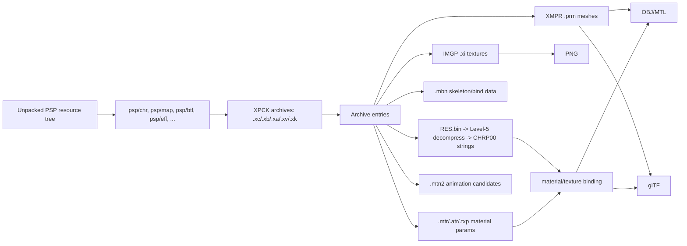

# Gundam AGE PSP Asset Research

Static asset extraction research and tools for **Gundam AGE PSP** Level-5
resources.

> This repository contains research notes and extraction/conversion tools only.
> It does not include game ISOs, game archives, extracted models, textures, or
> other copyrighted game data.

## What This Project Does

Reproducible static extraction pipeline:

```text
Already-unpacked PSP resource tree
  -> XPCK archive inspection/extraction
  -> Level-5 compressed payload decode
  -> IMGP/XI textures converted to PNG
  -> XMPR/PRM meshes exported to OBJ + MTL + glTF
  -> JSON/Markdown index and validation reports
```

Current status:

- character/mobile-suit static models preserve UVs, weights, and MBN bind-bone
  metadata in JSON/glTF outputs;
- sampled map archives export as textured static meshes;
- IMGP `.xi` texture export defaults to PSP 16-byte x 8-row deswizzle;
- remaining high-priority map gaps are mostly material-to-texture binding misses
  on large maps, not global texture decode failure;
- an archive-level model/texture index exists under `outputs/manifests/`.

## Table of Contents

**Getting started**

- [Requirements](#requirements)
- [Quick Start](#quick-start)
- [One-Command Tool: `age_start.py`](#one-command-tool-age_startpy)
- [Manual Stage Commands](#manual-stage-commands)
- [Tool Layout](#tool-layout)

**Reference**

- [Repository Layout](#repository-layout)
- [High-Level Resource Architecture](#high-level-resource-architecture)
- [Data Distribution](#data-distribution)
- [Format Notes](#format-notes)
- [Validation Strategy](#validation-strategy)
- [Third-Party References](#third-party-references)
- [Legal and Asset Handling](#legal-and-asset-handling)

---

## Requirements

Python 3.11+:

```powershell
python --version
python -m pip install pillow
```

Optional:

- Chrome/Edge for HTML viewer screenshots.
- .NET 9 only if you rebuild the optional local XMTN animation probe.

Input is a local PSP resource tree that has already been unpacked outside this
repo, for example:

```text
<PSP_RESOURCE_ROOT>
```

Generated output should go under `outputs/`, which is ignored by Git.

## Quick Start

Run from repository root:

```powershell
cd E:\research\Gundam-AGE-PSP
```

Show supported commands:

```powershell
python .\tools\age_start.py --help
```

Build the model/texture index list:

```powershell
python .\tools\age_start.py index "<PSP_RESOURCE_ROOT>" `
  --json .\outputs\manifests\age_asset_index.json `
  --compact-json .\outputs\manifests\age_asset_index.compact.json `
  --markdown .\outputs\manifests\AGE_ASSET_INDEX.md `
  --pipeline-root .\outputs `
  --exclude "*/map/*chr*.xc"
```

Current index outputs:

- `outputs\manifests\AGE_ASSET_INDEX.md`
- `outputs\manifests\age_asset_index.compact.json`
- `outputs\manifests\age_asset_index.json`

Export one archive to textures, OBJ, MTL, glTF, and manifests:

```powershell
python .\tools\age_start.py asset `
  "<PSP_RESOURCE_ROOT>\map\e1101.xc" `
  --out-dir .\outputs\pipeline\e1101 `
  --name e1101 `
  --overwrite
```

Validate selected large maps:

```powershell
python .\tools\age_start.py map validate `
  "<PSP_RESOURCE_ROOT>\map\e1101.xc" `
  "<PSP_RESOURCE_ROOT>\map\b3205.xc" `
  "<PSP_RESOURCE_ROOT>\map\b0101.xc" `
  --out-root .\outputs\map_validation\large_manual `
  --overwrite
```

## One-Command Tool: `age_start.py`

`tools/age_start.py` is the recommended entry point. It follows the same
repository style as the GBM workspace: one simple user-facing command delegates
to focused implementation modules.

```text
age_start.py
  xpck extract  -> age_xpck_tool
  asset         -> age_asset_pipeline
  character     -> age_asset_pipeline with animation opt-in
  map validate  -> research.age_map_validation
  map survey    -> research.age_map_survey
  index         -> age_asset_index
```

Important defaults:

| Option | Default | Meaning |
|---|---|---|
| `--texture-layout` | `psp-swizzled` | PSP 16-byte x 8-row deswizzle for `.xi` data |
| `--triangulation` | `strip` | Decode XPVI as triangle strips |
| character animation | `none` | Static export is default; pose export remains experimental |
| map export | static | Unweighted maps skip MBN bind loading |

## Manual Stage Commands

Use these when investigating one stage.

Extract one XPCK:

```powershell
python .\tools\age_start.py xpck extract `
  "<PSP_RESOURCE_ROOT>\map\e1101.xc" `
  --out .\outputs\extract\e1101 `
  --overwrite
```

Convert from an already extracted directory:

```powershell
python .\tools\age_asset_pipeline.py from-dir `
  .\outputs\extract\e1101 `
  --out-dir .\outputs\pipeline\e1101_from_dir `
  --name e1101 `
  --overwrite
```

Run a large map survey without keeping every extracted sample:

```powershell
python .\tools\age_start.py map survey `
  --input-root "<PSP_RESOURCE_ROOT>\map" `
  --out-root .\outputs\map_survey\all_non_chr `
  --exclude "*chr*.xc" `
  --cleanup-samples `
  --overwrite
```

## Tool Layout

Core reusable Python tools are flat in `tools/` for simple direct execution.

| Path | Purpose |
|---|---|
| `tools/age_start.py` | Main user-facing entry point |
| `tools/` | Core archive, texture, model, material, pipeline, and index modules |
| `tools/research/` | Validation, survey, catalog, probe, and preview helpers |
| `tools/tests/` | Unit tests |
| `tools/StudioElevenAnimationProbe/` | Ignored local optional .NET probe; not tracked |

Detailed tool notes: [docs/TOOLING.md](docs/TOOLING.md).

## Repository Layout

```text
Gundam-AGE-PSP/
  README.md
  .gitignore
  tools/
    age_start.py
    age_xpck_tool.py
    age_imgp_tool.py
    age_xmpr_tool.py
    age_material_bind.py
    age_gltf_tool.py
    age_asset_pipeline.py
    age_asset_index.py
    research/
      age_map_validation.py
      age_map_survey.py
      age_model_survey.py
      age_static_model_catalog.py
      age_obj_preview.py
    tests/
  docs/
    RESOURCE_ARCHITECTURE.md
    DATA_DISTRIBUTION.md
    BINARY_FORMATS.md
    TOOLING.md
    THIRD_PARTY_REFERENCES.md
    ASSET_EXTRACTION_RESEARCH.md
    LEVEL5_ASSET_WORKFLOW.md
    RESEARCH_LOG.md
  outputs/          # ignored generated artifacts
  external_tools/   # ignored local third-party clones
```

## High-Level Resource Architecture



More detail: [docs/RESOURCE_ARCHITECTURE.md](docs/RESOURCE_ARCHITECTURE.md).

## Data Distribution

Current index from the local PSP tree:

| Metric | Count |
|---|---:|
| XPCK archives indexed | 4529 |
| Parse errors | 0 |
| Archives with `.prm` models | 2364 |
| Archives with `.xi` textures | 2710 |
| Archives with both models and textures | 2343 |
| `.prm` model entries | 23880 |
| `.xi` texture entries | 9170 |
| material parameter entries | 46760 |

More detail: [docs/DATA_DISTRIBUTION.md](docs/DATA_DISTRIBUTION.md).

## Format Notes

| Format | Current status |
|---|---|
| `XPCK` | directory parse and extraction working |
| Level-5 compression | no-compression, LZ10, Huffman4/8, RLE, zlib paths implemented where needed |
| `RES.bin` / `CHRP00` | decompressed and used for resource/material strings |
| `IMGP` `.xi` | PNG export working with PSP deswizzle default |
| `XMPR` `.prm` | OBJ/glTF static export working |
| `XPVB` / `XPVI` | vertex/index decode working for sampled static assets |
| `.mtr/.atr/.txp` | material binding partially mapped |
| `.mbn` | character bind data useful; skipped for unweighted maps |
| `.mtn2` | optional animation probe only; full animation export not final |

More detail: [docs/BINARY_FORMATS.md](docs/BINARY_FORMATS.md).

## Validation Strategy

Validation is evidence-first:

- parse real local archives;
- export JSON manifests at each stage;
- render map/model preview images under `outputs/previews`;
- compare large map controls against large map problem cases;
- keep unresolved material counts in Markdown/JSON reports.

Current map evidence:

- full non-`chr` map survey: `285` samples, `0` failures;
- `198` visually clean;
- `54` plain unresolved material cases;
- `33` effect-only unresolved cases;
- large clean controls include `t5201`, `t0901`, `e2104`, and `b3003`;
- priority problem maps include `e1101`, `b3205`, `b0101`, `b3104`,
  `t0201`, and `e3108`.

## Third-Party References

Third-party GitHub repositories are not tracked in this repo. Local clones, if
present, live under ignored `external_tools/`.

Reference links and usage notes:

- [Tiniifan/studio_eleven](https://github.com/Tiniifan/studio_eleven)
- [Tiniifan/StudioElevenLib](https://github.com/Tiniifan/StudioElevenLib)
- [Ploaj/Metanoia](https://github.com/Ploaj/Metanoia)
- [albe/openTri](https://github.com/albe/openTri)
- [Tiniifan/Pingouin](https://github.com/Tiniifan/Pingouin)
- [Tiniifan/Level5ResourceEditor](https://github.com/Tiniifan/Level5ResourceEditor)
- [Tiniifan/level5_material](https://github.com/Tiniifan/level5_material)
- [FanTranslatorsInternational/Kuriimu2](https://github.com/FanTranslatorsInternational/Kuriimu2)

More detail: [docs/THIRD_PARTY_REFERENCES.md](docs/THIRD_PARTY_REFERENCES.md).

## Legal and Asset Handling

This repository is for interoperability and local research tooling. It does not
grant rights to Gundam AGE PSP assets.

Do not commit:

- PSP game archives or extracted archives;
- generated PNG/OBJ/MTL/glTF/bin files;
- `outputs/`;
- local third-party clones under `external_tools/`;
- `tools/StudioElevenAnimationProbe/`.

The `.gitignore` file is configured for those boundaries.


